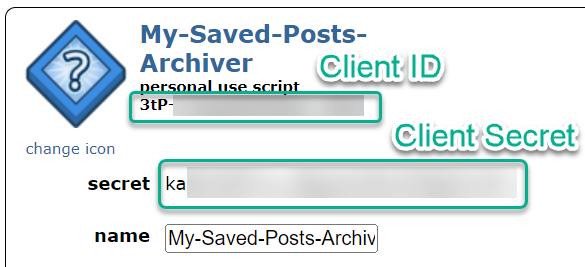

# My Reddit Archiver

Archive Saved posts under your Reddit account.

- [My Reddit Archiver](#my-reddit-archiver)
  - [Setup](#setup)
    - [Create Reddit Client ID And Secret](#create-reddit-client-id-and-secret)
      - [Limitations](#limitations)
        - [2FA](#2fa)
    - [Configure Application](#configure-application)
    - [Start Application](#start-application)
  - [Execute Sync](#execute-sync)
  - [Development](#development)

## Setup

### Create Reddit Client ID And Secret

Firstly, a Reddit Client ID and Client Secret must be generated in order to configure the application.

1. While logged into Reddit, navigate to [Authorized Applications](https://www.reddit.com/prefs/apps).
2. Scroll to the bottom of the page and click **create another app**.
3. Provide the following information:
    - Name: a name for client app
    - Select **script**
    - Redirect URI: though not used at this time for this project's current implementation, this is needed to create the client app. The server url where the project will be served can be used here.
4. Click **create app**.
5. Note down the *Client ID* and *Client Secret* as shown in the following screenshot:
    - 

#### Limitations

##### 2FA

The application requires your Reddit `Password` to be provided in the configuration. This is used to make authenticated OAuth calls in order to use Reddit's API. As a result, this flow does not work if 2FA is enabled on the target Reddit account. This may be addressed in the future with a redirect to Reddit for login, but at this time, the only workaround is to disable 2FA.

### Configure Application

Create docker-compose.yml file:

```bash
cp docker-compose.sample.yml docker-compose.yml
```

Update the following values in the created `docker-compose.yml` file:

- REDDIT_USERNAME
- REDDIT_PASSWORD
- REDDIT_CLIENT_ID
  - The `Client ID` generated in the previous section.
- REDDIT_CLIENT_SECRET
  - The `Client Secret` generated in the previous section.
- DATABASE_URL
  - The DSN used to connect to the database. Must be formatted as follows:
    - mysql://DB_USER:DB_USER_PASSWORD@DB_HOST:3306/DB_DATABASE_NAME?serverVersion=mariadb-10.8.3&charset=utf8mb4

If using the database included in the `docker-compose.yml` file, the following parameters also need to be updated:

- MARIADB_ROOT_PASSWORD
- MARIADB_USER
  - This value will be used in the `DATABASE_URL` above.
- MARIADB_PASSWORD
  - This value will be used in the `DATABASE_URL` above.
- MARIADB_DATABASE
  - This value will be used in the `DATABASE_URL` above.

### Start Application

Once the `docker-compose.yml` is configured, the application can be started using the following command:

```bash
docker-compose up -d
```

## Execute Sync

Once the application is configured and running, use the following command to execute the syncing of the Reddit profile's `Saved` Posts down to the local system:

```bash
docker exec -it mra-api ./sync-api
```

## Development

For developing in this application, see [Development](docs/development/README.md).
